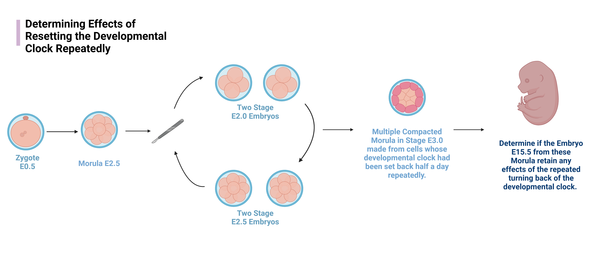
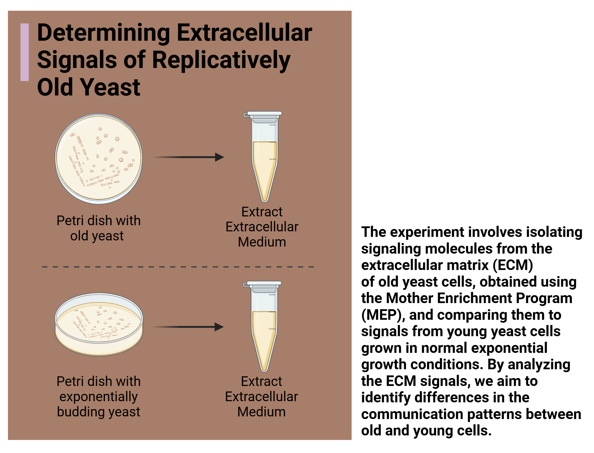
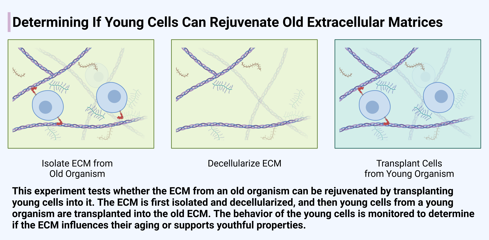

### Hypotheses

- [Experiment 1](https://github.com/DavidWarrenKatz/programmedAging/blob/main/experiments/serial_transfer_Tcell.md): Testing 
- [Experiment 2](https://github.com/DavidWarrenKatz/programmedAging/experiments/serial_transfer_Tcell.md):
- [Experiment 3]():  
- [Experiment 4](): 
- [Experiment 5]():
  
***1. The body’s developmental clock also governs aging.***
There is a biological clock governing development and puberty, and perhaps menopause. This clock may be related to the circadian oscillators in each cell and the yearlong oscillators governing molting, hibernation, and breeding seasons. Programmed theories of aging view aging as a stage of development. Thus, programmed theories of aging suggest that the developmental clock likely also governs aging. Nonprogrammed theories of aging, on the other hand, view aging as a side effect of the body program, and thus do not believe the rate of aging is governed by signals from the developmental clock. Thus, programmed and nonprogrammed theories disagree on whether the developmental clock should be a target of therapeutics. 

***2. The body controls aging through a robust signaling network.***
Programmed theories of aging view aging as being directly selected for by evolution and robust to stochastic mutations that may arise in evolution. This is why we do not see extremely long lived mutants. This suggests that the body’s aging program is robust. If signals in the aging program are knocked down, the body will respond by upregulating different signals that have the same downstream effect. This is a clear difference of prediction with nonprogrammed theories of aging. From the nonprogrammed perspective, mutations do not cause life extension because the body is already trying its best to survive. Knocking out aging signals are not robust, since the tradeoff will punish such mutations anyway. 

***3. Organisms have the ability to remain young indefinitely.***
Programmed theories of aging explain rejuvenation as turning back the biological clock, and believe that organisms have the ability to remain young indefinitely if the body receives youth signals from the biological clock. Programmed theories view an old body as a body that has not lost its ability to function - just look how well it is running the aging program! Nonprogrammed theories, on the other hand, view old bodies as worn out. These theories believe that, in general, only the germline can be rejuvenated and the soma has no ability to rejuvenate itself. Epigenetic reprogramming is explained as taking advantage of 

***4. Evolution often wants organisms to enter into the grandfatherly role in their populations.*** 

***5. There may be two distinct aging programs: a sudden death program and a gradual aging program.***

***6. There are other mechanisms of evolution other than natural selection.***

Here are experiments that will provide evidence for these hypotheses.    
  
  
 
 
