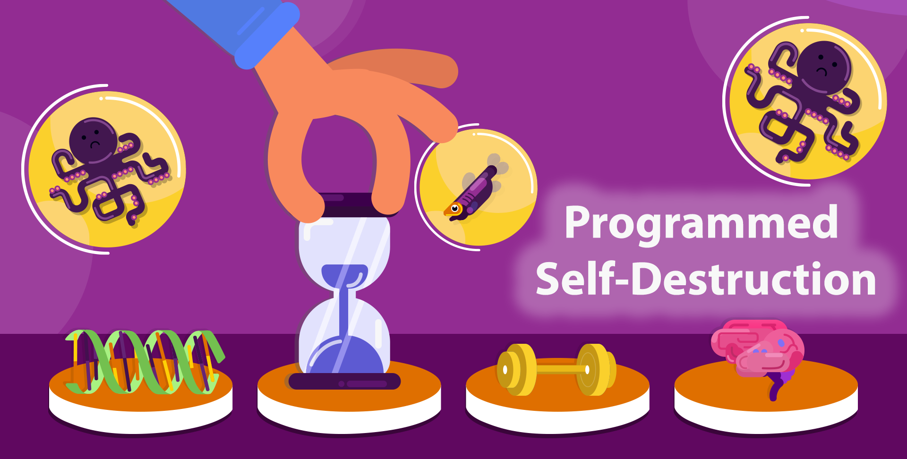

# The Programmed Aging Theory

Aging is the increasing risk of mortality from internal causes. Many plants and some animals do not age. Sequoia trees, for example, grow stronger and  hardier with each passing year for thousands of years. No law of biology states that an old body cannot be stronger and healthier than a young body. So why then do most organisms age, and  why is there so much variability in the lifespans of different organisms?  One answer to this important question is the **Programmed Aging** theory. This theory posits that aging was selected for by evolution and is the result of programmed self-destruction pathways governed by biological clocks. That is, we age for the same reason we go through puberty - **aging is built into who we are**.

It is generally acknowledged that the sudden death of semelparous animals and monocarpic plants is the result of active self-destruction programs. It is also generally acknowledged that the timing of development is the result of active developmental programs. That is, it is generally acknowledged that the body knows when it is time to mature, and, in the case of semelparous organisms, the body knows when it is time to die. However, almost all biologists refuse to consider the hypothesis that for organisms in general, the body knows when it is time to die, and grows more and more prone to death as a result of active self-destruction pathways. 

This GitHub page serves to summarize the evidence supporting the Programmed Aging theory and to explore its broader implications.

[Genetic Basis of Aging](genetic_basis.md)
 
[The How and Why of Aging](HowAndWhy.md)

[Hypotheses](Hypotheses(inprogress).md)

  

  

