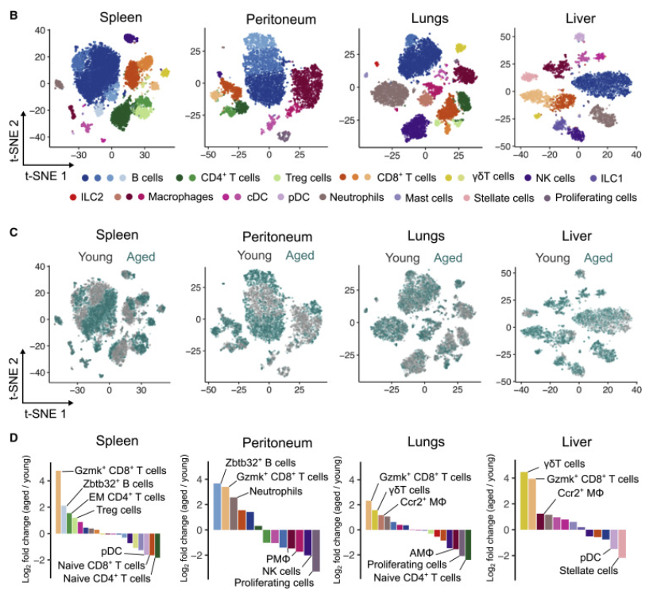

# Maxim N. Artyomov

Maxim N. Artyomov is an immunologist recognized for his research on immune system aging, particularly the mechanisms of chronic inflammation and clonal expansion in aging immune cells.

---

## Key Publications

### 1. [**Comprehensive Profiling of an Aging Immune System Reveals Clonal GZMK+ CD8+ T Cells as Conserved Hallmark of Inflammaging**](https://www.sciencedirect.com/science/article/pii/S1074761320304921#:~:text=As%20a%20result%2C%20we%20comprehensively%20described%20the%20cellular,population%20that%20is%20conserved%20between%20the%20two%20species.)
**Denis Mogilenko et al. and Maxim N. Artyomov, Immunity, 2020**

**Summary**:  
The authors generated a multi-omics (mainly just scRNA-Seq) single cell dataset of the immune system and identified a new class of CD8+ T cells that emerged with aging. This emergence was then confirmed in public (better quality) datasets as well as heterochronic transfer experiemnts. These aging-associated CD8+ clonal T cells (Taa) were characterized by their expression of Gzmk as well as their co-expression of the transcription factor TOX (exhaustion) and the checkpoint molecule PD-1. This emergence of this cell population with age cannot yet be confirmed by flow cytometry, but was supported by other approaches. Gzmk was not detected in cells other than this subpopulation of T cells. 

**Image**:  
  

More specifically, scRNA was performed on approximately 35,000 cells from four tissues (spleen, peritoneom, lungs, liver) and two age-points (3-6 months and 17-24 months) in six male C57BL/6J mice. For each tissue, highly variable genes were selected and then dimensionality reduction was performed on variable genes to call cell-type clusters. Within each cluster, subclusters were called by measuring expression levels of a list of marker genes. For each subcluster, differential expression analysis for each of the two timepoints was performed. Gzmk+ CD8+ T cells were identifed as being significantly upregulated in old age mice in all four tissues by this analysis. 

To validate this reuslt, flow cytometry on an independent cohort of mice was used to prior to another round of RNA-Seq was performed. In my opinion, the results of this second analysis neight confirm or reject the previous analysis. In this analysis, six tissue types were included. 

provide a detailed profiling of the aging immune system in both humans and mice, identifying clonal GZMK+ CD8+ T cells as a conserved feature of inflammaging. These GZMK+ CD8+ T cells accumulate with age and contribute to a chronic inflammatory state that characterizes aged immune systems. The study highlights these cells as potential markers of immune aging and suggests that targeting this population could alleviate age-related inflammation.

**Commentary**:  
This research significantly advances our understanding of the immune components contributing to inflammaging, particularly the role of clonal expansions in CD8+ T cells. The identification of conserved markers like GZMK+ CD8+ T cells opens avenues for developing therapeutic strategies aimed at modulating immune function in aging populations. This work underscores the potential for rejuvenating immune responses by selectively targeting cells that drive chronic inflammation without affecting the broader immune functionality.

**Image**:  
*Caption*: Representative visualization of GZMK+ CD8+ T cells as a conserved marker of aging in human and mouse immune profiles, as presented in the study. The cells show characteristic markers that increase with age and contribute to a chronic inflammatory environment.
