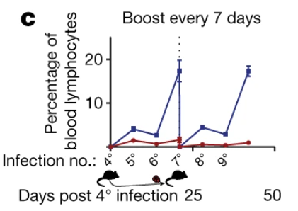

# David Masopust

David Masopust is a biologist recognized for his work in immunology, particularly in understanding T cell biology, memory, and function. 

---

## Publications

### 1. [**Functional T cells are capable of supernumerary cell division and longevity**](https://www.nature.com/articles/s41586-022-05626-9)
**Andrew G. Soerens et al. and David Masopust, Nature, 2022**  

**Summary**:  
The authors activated mouse CD8+ T cells in vivo using a heterologous prime–boost–boost vaccination strategy. Expanded cells from middle-aged (~1 year old) mice were transferred to younger (8–10 weeks old) mice, and this process was repeated iteratively with the same T cells. Over 10 years, these T cells retained their ability to respond to vaccination at levels comparable to young endogenous T cells. Some of the original T cells expanded by at least 10^40-fold during this period, far exceeding the normal proliferative and longevity capacities of T cells during their usual lifespan. The iteratively stimulated T cells were distinct from younger, endogenous T cells, with unique epigenetic and transcriptional profiles reflecting the number of prior stimulations. However, these cells exhibited youthful capabilities in terms of proliferation, persistence, and immune response, performing on par with young T cells in many respects without becoming cancerous. However, the iteratively stimulated T cells did exhibit some signs of functional exhaustion, including expression of the senescence marker KLRG1. 

Also notable was the fact that the iteratively transfered T cells mounted a robust immune response without the advantage of immune memory. The respose of the iteratively stimulated T cells paralleled that of young, endogenous T cells encountering an infection for the first time, indicating that the transfer resets the immune experience of these cells. Although this effect may be attributed to the small number of T cells that were transfered. 

**Image**:  

    

        
        
<strong>Figure 1A</strong>

    

    

        
        
<strong>Figure 1C</strong>

    

**Commentary**:  
I hypothesize that the critical factor is the number of days the T cells spend in a young body, rather than the interval between immunizations. The authors, however, suggest that the time between immunizations and the need for T cells to rest are the key factors in their rejuvenation. This could be tested by allowing the T cells to remain in the young body for a longer period before administering the short immunization intervals. However, T cells tend to self-destruct after immune stimulation, which may be why the authors chose to transfer and vaccinate the young mice immediately after the previous vaccination. Notably, the immune response peaked following the third stimulation in each mouse, despite the CD8+ T cells being exposed to the stimulants multiple times before. This suggests that the CD8+ T cell response relies on signals from the entire immune system rather than simply repeated exposure.

**Suggested Further Experiments**:

To further explore the role of immune signaling in the iterative rejuvenation of CD8+ T cells, I suggest to co-transfer of CD4+ T cells alongside CD8+ T cells. By assessing the influence of CD4+ T cells on the functional longevity and responsiveness of CD8+ T cells, this setup could reveal any cross-signaling effects essential for sustained immune capacity. This would also allow for an analysis of differences in the RNA-seq expression profiles of CD8+ T cells when co-transferred with CD4+ cells versus independently transferred.

Further questions to think about" Are these iteratively transfered cells migrating? Are they commiting to the memory fate? To what extent are they forgetting that they have seen the infection? Is the immune memory stored in the T cells? How many lymphocytes do we need to transfer before immune memory is transfered? 

--- 

